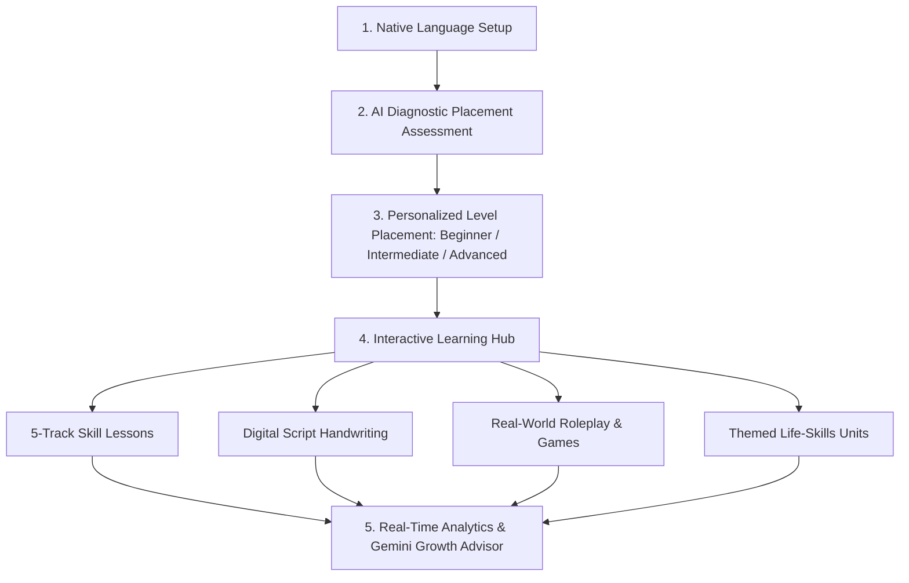

# 📖 AksharGyan (अक्षरज्ञान) — AI-Powered Multilingual Literacy & Language Learning Platform

> **AksharGyan** is an intelligent, gamified, and accessible multilingual literacy platform designed to help learners of all ages master reading, writing, listening, speaking, and pronunciation across **7 Indian and global languages**.

---

## 🌟 Table of Contents
1. [About the Project](#-about-the-project)
2. [How It Works (The Learner Experience)](#-how-it-works-the-learner-experience)
3. [Core Learning Pillars](#-core-learning-pillars)
4. [7 Supported Languages](#-7-supported-languages)
5. [How It Is Built (Architecture & Technology)](#-how-it-is-built-architecture--technology)
6. [Live Application](#-live-application)
7. [Authors & Acknowledgments](#-authors--acknowledgments)

---

## 🎯 About the Project

Foundational literacy and language acquisition in India require a native-first, multi-sensory approach. Traditional language apps often rely on English as the mandatory medium of instruction, creating an entry barrier for vernacular learners.

**AksharGyan** solves this by offering **bidirectional learning** where the entire interface, instructions, voice feedback, and AI assistance adapt directly to the learner's chosen native language.

### Core Objectives:
- **Democratize Multilingual Literacy**: Enable foundational literacy in native scripts and phonetics.
- **Adaptive AI Diagnostics**: Eliminate repetitive beginner tasks for experienced learners through intelligent placement.
- **5-Dimensional Mastery**: Balanced development across **Reading, Writing, Listening, Speaking, and Pronunciation**.
- **Interactive Script Tracing**: Digital handwriting practice for complex Indian alphabets and ligatures.
- **Gamified Motivation**: Duolingo-style streak tracking, leagues, XP achievements, and daily quests.

---

## 🚀 How It Works (The Learner Experience)

### 1. Onboarding & Language Selection
- Learners choose their **Native Language** (the language the platform speaks and guides them in) and their desired **Target Language** (the language they want to learn).
- The entire interface immediately translates and customizes itself to the selected native tongue.

### 2. Adaptive Placement Assessment
- Instead of starting from scratch, new learners take a 5-minute diagnostic assessment that evaluates vocabulary recognition, audio comprehension, sentence formation, and grammar.
- **Google Gemini AI** analyzes the assessment responses, determines the CEFR proficiency level (**Beginner A1**, **Intermediate B1**, or **Advanced C1**), and automatically unlocks the appropriate curriculum stage.

### 3. Progressive 3-Stage Curriculum
- **Beginner (A1)**: Alphabet phonetics, basic word building, script tracing, and foundational vocabulary.
- **Intermediate (B1)**: Sentence formation, conversational dialogues, verb conjugations, and practical grammar.
- **Advanced (C1)**: Complex situational expressions, proverbs, workplace phrases, and advanced comprehension.

### 4. Bite-Sized Interactive Exercises
- **Visual Multiple Choice**: Match native words with picture associations and definitions.
- **Sentence Scramble**: Drag and assemble words to form grammatically correct native sentences.
- **Voice & Pronunciation**: Listen to native voice pronunciations and speak into the microphone for real-time speech evaluation.
- **Listening Comprehension**: Identify correct words and contextual phrases from authentic native speech.

### 5. AksharTrace Digital Handwriting
- An interactive digital canvas that guides learners stroke-by-stroke to write Indian scripts.
- Provides visual stroke references, custom brush sizes, clear/undo tools, and stroke accuracy verification.

### 6. Real-World Situational Scenarios & Word Games
- **Conversational Roleplays**: Interactive chat simulations for real-life contexts like *At the Bank*, *Doctor Consultation*, *Railway Ticket Booking*, and *Marketplace Shopping*.
- **Vocabulary Mini-Games**: Five engaging games (*Word Builder*, *Word Safari*, *Word Race*, *Word Search*, and *Vocabulary Crosswords*) to reinforce vocabulary retention through play.

### 7. Real-Time Analytics & AI Growth Advisor
- **Skill Breakdown**: Dedicated accuracy meters across all 5 literacy tracks to highlight strengths and areas needing focus.
- **Accuracy Trend Line**: Interactive historical progression chart tracking improvement over time.
- **Practice Calendar**: Month-by-month consistency tracker with active streaks and practice duration.
- **AI Growth Advisor**: A personalized AI coach on the dashboard that diagnoses recent attempts and provides targeted advice on what exercises to practice next.

### 8. Gamification & Community
- **XP & Streaks**: Earn experience points for completing lessons and maintain daily practice streaks.
- **Competitive Leagues**: Advance from Bronze to Diamond tiers on weekly community leaderboards.
- **Study Groups**: Create or join study clubs with friends, challenge peers, and share achievement cards.

---

## 🧩 Core Learning Pillars

| Pillar | How It Works | Pedagogical Benefit |
| :--- | :--- | :--- |
| **📖 Reading** | Visual identification, phonetic associations, and contextual sentence reading. | Builds rapid script comprehension and reading confidence. |
| **✍️ Writing** | AksharTrace canvas engine for interactive digit-by-digit script drawing. | Develops muscle memory for Indian characters and ligatures. |
| **🎧 Listening** | Authentic native voice audio clips with speed control and phonetic replay. | Trains auditory discernment of similar native vowel/consonant sounds. |
| **🗣️ Speaking** | Browser microphone speech recognition with real-time accuracy scoring. | Overcomes hesitation and builds conversational fluency. |
| **🔤 Pronunciation** | Syllable-by-syllable phonetic breakdowns and acoustic comparison. | Ensures accent clarity and accurate tonal articulation. |

---

## 🇮🇳 7 Supported Languages

AksharGyan provides bidirectional learning and localized UI for:

1. **Hindi (हिन्दी)**
2. **Kannada (ಕನ್ನಡ)**
3. **Tamil (தமிழ்)**
4. **Telugu (తెలుగు)**
5. **Bengali (বাংলা)**
6. **Marathi (मराठी)**
7. **English**

---

## 🛠️ How It Is Built (Architecture & Technology)

### 🎨 1. Frontend & Design System
- Built with standard web technologies (**HTML5**, **Modern JavaScript ES6+**, **Vanilla CSS3**) for speed and universal device compatibility.
- **Design Language**: Custom Glassmorphism UI with Tailwind-inspired design tokens, responsive CSS Grid and Flexbox layouts, modern typography, and smooth micro-animations.
- **Progressive Web App (PWA)**: Includes Service Worker caching and Web App Manifest for offline resiliency and mobile/desktop installability.

### 🧠 2. AI & Diagnostic Engine
- **Google Gemini 2.0 / 1.5 Flash**:
  - **Diagnostic Placement Engine**: Evaluates initial assessment results, produces qualitative pedagogical summaries, and determines CEFR placement levels.
  - **AI Performance & Growth Advisor**: Analyzes recent lesson accuracies, identifies weakest and strongest tracks, and generates personalized coaching tips in the learner's native language.
- **Zero-Downtime Heuristic Fallback**: A local deterministic diagnostic engine guarantees continuous functionality even during offline modes or API limits.

### ☁️ 3. Cloud Infrastructure & Real-Time Database
- **Google Firebase**:
  - **Firebase Authentication**: Secure user management with Google OAuth and Email/Password sessions.
  - **Cloud Firestore (NoSQL)**: Real-time synchronization for learner progress profiles, XP tallies, completed lesson arrays, streak trackers, league rankings, and timestamped lesson history subcollections.

### 🎙️ 4. Multilingual Speech & Audio Pipeline
- **Web Speech API**:
  - **SpeechSynthesis (TTS)**: Dynamic text-to-speech audio rendering with locale-specific voice mapping for all 7 languages.
  - **SpeechRecognition (STT)**: Acoustic capture and speech-to-text transcription for interactive pronunciation scoring.

### ✍️ 5. Interactive Digital Canvas
- **HTML5 Canvas API**: Custom stroke-capture engine that tracks touch and mouse coordinates in real time for writing practice with customizable brush thicknesses and canvas clearing.

### 📊 6. Data Visualization & UI Enhancements
- **Chart.js**: Interactive spline-curve accuracy graphs with dynamic canvas gradients and hover tooltips.
- **Lucide Icons**: Clean, scalable vector iconography.
- **Canvas-Confetti**: Particle reward animations for celebrating lesson completion, streak milestones, and level promotions.

---

## 🌐 Live Application

The project is deployed and accessible on **Firebase Hosting**:

- **🚀 Live Website**: **[https://infosyssb-501215.web.app](https://infosyssb-501215.web.app)**
- **GitHub Repository**: **[Ayushbms05/Infosys-SpringBoard-Internship-Project](https://github.com/Ayushbms05/Infosys-SpringBoard-Internship-Project.git)**

---

## 👨‍💻 Authors & Acknowledgments

- **Developer**: Ayush Kumar ([@Ayushbms05](https://github.com/Ayushbms05))
- **Program**: **Infosys SpringBoard Internship Project**
- **Mentorship**: Infosys SpringBoard Team
